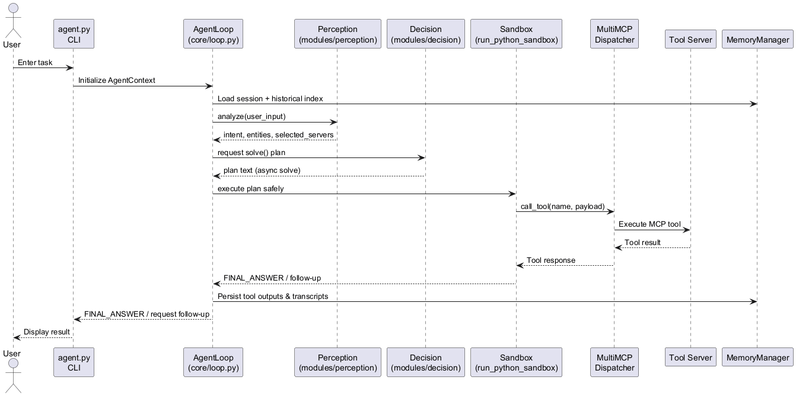

# Cortex‑R Agent (Session‑9)

## Overview

Cortex‑R is a reasoning-driven, multi-tool AI agent. It blends structured prompting, heuristic validation, and memory to dispatch tasks to MCP-enabled tool servers (math, documents, web search). The agent runs from the command line (`uv run agent.py`), orchestrating perception → planning → execution loops until it reaches a final answer.

**Key traits**

- **Multi-step, tool-aware reasoning** through `core/loop.AgentLoop`
- **Configurable prompt/path selection** (conservative vs. exploratory)
- **Heuristic guardrails** for inputs, prompts, and tool usage
- **Historical memory ingestion** so past sessions influence new plans
- **Flexible config** via `config/profiles.yaml` and `config/models.json`

---

## Quick Start

### Prerequisites

- Python 3.11+
- [uv](https://github.com/astral-sh/uv) or pip for dependency management
- MCP-compatible tool servers (already present under `mcp_server_*.py`)
- Optional: [Ollama](https://ollama.ai) for local text/embedding models (expects `http://localhost:11434`)

### Installation

```bash
# Clone the repository
git clone <repo-url>
cd Session-9

# Using uv (recommended)
uv sync

# or with pip / venv
python -m venv .venv
. .venv/Scripts/activate            # or source .venv/bin/activate
pip install -r requirements.txt     # if provided
```

### Running the Agent

```bash
uv run agent.py
```

You’ll be greeted with `🧠 Cortex-R Agent Ready`. Interact via the CLI prompt:

- Type a task (e.g., `Summarize this page: https://theschoolof.ai/`).
- Type `new` to reset the session but keep the process running.
- Type `exit` to quit.

---

## Configuration

### Model & Tool Profiles

- `config/profiles.yaml` holds strategy, memory, and MCP server definitions.
- `config/models.json` maps logical model keys (`gemini`, `llama3:8b`, `nomic`, …) to actual providers (Gemini API, Ollama, etc.).

Switch to a local model by editing:

```yaml
llm:
  text_generation: llama3:8b
  embedding: nomic  # uses Ollama nomic-embed-text when enabled below
```

### Memory & Historical Index

```yaml
memory:
  memory_service: true
  summarize_tool_results: true
  tag_interactions: true
  storage:
    base_dir: "memory"
  historical_index:
    enabled: true
    path: "faiss_index/history"
    max_items: 50
    file_extensions: [".json", ".jsonl", ".txt"]
    transcripts:
      enabled: true
      filename: "transcripts.jsonl"
```

- Set `enabled: true` to ingest prior transcripts stored under `faiss_index/history`.
- Flip `transcripts.enabled` to `true` so each session appends to the shared JSONL log.
- At startup the agent logs `Historical index active: loaded N item(s) from …` so you can verify ingestion.

---

## Enhancements

### 1. Heuristics Library
- Implementation: `heuristics_lib/heuristics_validators.py`
- Unit tests: `heuristics_lib/test_heuristics.py`

Run:

```bash
python -m unittest heuristics_lib.test_heuristics
```

### 2. Prompt Optimization & Test Harness
- Optimized prompt: `prompts/decision_prompt_conservative_opt2.txt`
- Evaluation suite: `tests/test_prompt_performance.py`
- Judge shim with optional real LLM checks: `tools/llm_judge.py`

```bash
python -m unittest tests.test_prompt_performance
python tests/test_prompt_performance.py --prompt both \
    --llm-judge-command "python tools/llm_judge.py --pretty"
```

Add `--use-real-llm` to the judge command to route comparisons through Ollama.

### 3. Historical Conversation Indexing
- Historical transcript ingestion controlled via `memory.historical_index` in `profiles.yaml`.
- Each run can append to `faiss_index/history/transcripts.jsonl` when `transcripts.enabled` is true.
- JSON/JSONL entries are normalized into `MemoryItem`s tagged `historical` and become part of the planning context.

---

## Architecture & Design

### Runtime Sequence



### Key Modules

- `core/context.py`: wraps `AgentProfile`, `MemoryManager`, and session metadata.
- `core/loop.py`: orchestrates perception → planning → execution with heuristics and error handling.
- `modules/perception.py`: turns user input into intent + server/tool hints.
- `modules/decision.py`: prompts the LLM to output an executable `solve()` plan.
- `modules/action.py`: sandbox with tool call limits and dispatcher injection.
- `modules/memory.py`: stores live memory, loads historical transcripts, persists new sessions.

---

## Testing & Quality

- Prompt parity: `python -m unittest tests.test_prompt_performance`
- Heuristics: `python -m unittest heuristics_lib.test_heuristics`
- Manual CLI runs (`uv run agent.py`) are encouraged; logs highlight follow-up heuristics and tool errors.

---

## Tooling Tips

Generate UML diagrams via Pyreverse + Graphviz:

```bash
# Class / package diagrams (PDF)
pyreverse -o dot -p session9 -A -S .
dot -Tpdf classes_session9.dot -o classes_session9.pdf
dot -Tpdf packages_session9.dot -o packages_session9.pdf

# Focus on core modules
pyreverse -o dot -p session9_core -A -S core/*.py
dot -Tpng classes_session9_core.dot -o classes_session9_core.png
```

If you prefer package-level imports, add minimal `__init__.py` files before running Pyreverse on directories.

---

## Troubleshooting

| Issue | Suggested Fix |
| ----- | -------------- |
| `No module named __init__` while running Pyreverse | Target direct files (`core/*.py`) or add `__init__.py` |
| Ollama not reachable | Ensure `ollama serve` is running; pull `nomic-embed-text` / `llama3:8b` |
| `404 Client Error` from embeddings | Verify embeddings endpoint or switch `embedding` model |
| `429 RESOURCE_EXHAUSTED` from Gemini | Increase quota, throttle requests, or switch to local Ollama |
| Redirect pages returned as answers | Built-in heuristics re-plan; consider alternative tools if it persists |

---

## Contributing

1. Fork and clone the repo.
2. Create a feature branch (`git checkout -b feature/foo`).
3. Run unit tests before submitting a PR.
4. Document new modules/tests in this README.

---

## License

_Not specified._ Add a `LICENSE` file or clarify the intended license before distributing.

---

## Acknowledgements

- MCP specification and sample servers
- Ollama (local LLM inference)
- Pyreverse / Graphviz tooling
