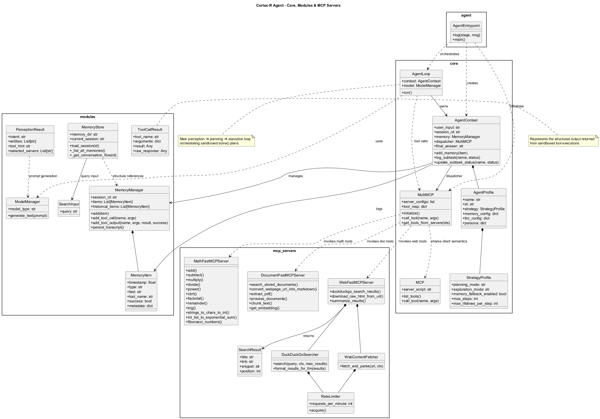
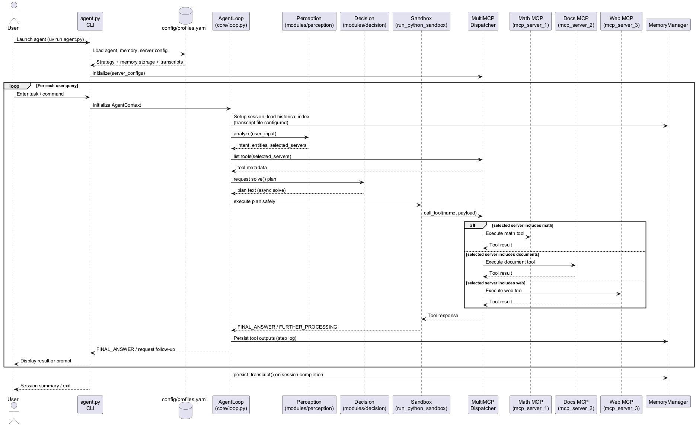

# Cortex‑R: Multi-MCP Agent App 🤖🧠

[](https://www.python.org/) [](https://platform.openai.com/) []() []() []()

## Overview

Cortex‑R is a reasoning-driven, multi-tool AI agent. It blends structured prompting, heuristic validation, and memory to dispatch tasks to MCP-enabled tool servers (math, documents, web search). The agent runs from the command line (`uv run agent.py`), orchestrating perception → planning → execution loops until it reaches a final answer.

**Key Features**

- **Multi-MCP Server Orchestration**: Math, document, web, and memory servers
- **Multi-step, tool-aware reasoning** through `core/loop.AgentLoop`
- **Strategic prompt engineering**: Conservative, Exploratory, Fallback, etc.
- **Heuristic guardrails**: For safe inputs, prompts, LLM calls and tool usage
- **Historical memory ingestion**: So past sessions influence new plans
- **Memory and context management**: For stepwise, context-aware problem solving
- **Flexible config**: via `config/profiles.yaml` and `config/models.json`
- **RAG & Document Search**: FAISS-based semantic search over local and web docs
- **Extensible Tooling**: Add new tools and servers with minimal code changes
---

## Quick Start

### Prerequisites

- Python 3.12+
- [uv](https://github.com/astral-sh/uv) or pip for dependency management
- MCP-compatible tool servers (already present under `mcp_server_*.py`)
- Optional: [Ollama](https://ollama.ai) for local text/embedding models (expects `http://localhost:11434`)

### Installation

```bash
# Clone the repository
git clone https://github.com/dbvb2k/DBVB-EAGV2-S9 Session-9
cd Session-9

# Using uv (recommended)
uv sync

# or with pip / venv
python -m venv .venv
. .venv/Scripts/activate            # or source .venv/bin/activate
pip install -r requirements.txt     # if provided
```

### Directory Structure

```
Session-9/
├── agent.py                    # Main entry point
├── models.py                   # Pydantic models for MCP tools
├── pyproject.toml              # Project dependencies (uv)
├── uv.lock                     # Dependency lock file
│
├── config/                     # Configuration files
│   ├── profiles.yaml          # Agent strategy, memory, MCP server configs
│   └── models.json            # LLM model mappings (Gemini, Ollama, etc.)
│
├── core/                       # Core agent orchestration
│   ├── context.py             # AgentContext, AgentProfile
│   ├── loop.py                # Main AgentLoop (perception → planning → execution)
│   ├── session.py             # MCP client/dispatcher (MultiMCP)
│   └── strategy.py            # Prompt path selection, decision logic
│
├── modules/                    # Agent modules
│   ├── action.py              # Sandbox execution (run_python_sandbox)
│   ├── decision.py            # Plan generation (generate_plan)
│   ├── memory.py              # MemoryManager (session + historical)
│   ├── model_manager.py       # LLM wrapper (Gemini, Ollama)
│   ├── perception.py          # Intent extraction (extract_perception)
│   ├── tools.py               # Tool summarization utilities
│   └── mcp_server_memory.py   # MCP server for memory queries
│
├── prompts/                    # LLM prompt templates
│   ├── perception_prompt.txt
│   ├── decision_prompt_conservative.txt
│   ├── decision_prompt_conservative_opt2.txt
│   ├── decision_prompt_exploratory_parallel.txt
│   └── decision_prompt_exploratory_sequential.txt
│
├── mcp_server_*.py            # MCP tool servers (math, documents, web)
│   ├── mcp_server_1.py        # Math tools (add, subtract, fibonacci, etc.)
│   ├── mcp_server_2.py        # Document tools (search, extract PDF, markdown)
│   └── mcp_server_3.py        # Web search tools (DuckDuckGo)
│
├── memory/                     # Session memory storage (date-based)
│   └── YYYY/MM/DD/session/    # Individual session JSON files
│
├── history/                    # Historical transcripts (if enabled)
│   └── transcripts.jsonl     # Shared transcript log
│
├── faiss_index/               # FAISS vector index for document search
│   ├── index.bin
│   ├── metadata.json
│   └── doc_index_cache.json
│
├── documents/                  # Source documents for indexing/search
│   ├── *.pdf, *.md, *.txt, *.docx
│   └── images/
│
├── heuristics_lib/            # Input/output validation heuristics
│   ├── heuristics_validators.py
│   └── test_heuristics.py
│
├── tests/                      # Unit tests
│   ├── test_prompt_performance.py
│   └── prompt_benchmark_samples.json
│
└── images/                     # Documentation assets
    └── classdiag.png           # High level class diagram
    └── sequencediag.png        # High level sequence diagram
    └── fibonacciquerylog.txt   # Sample log 1
    └── newssummarizelog.txt    # Sample log 2
    └── teslaquerylog.txt       # Sample log 3
    
```

### Running the Agent

```bash
uv run agent.py
```

You’ll be greeted with `🧠 Cortex-R Agent Ready`. Interact via the CLI prompt:

- Type a task (e.g., `Summarize this page: https://theschoolof.ai/`).
- Type `new` to reset the session but keep the process running.
- Type `exit` to quit.

---

## Configuration

### Model & Tool Profiles

- `config/profiles.yaml` holds strategy, memory, and MCP server definitions.
- `config/models.json` maps logical model keys (`gemini`, `llama3:8b`, `nomic`, …) to actual providers (Gemini API, Ollama, etc.).

Switch to a local model by editing:

```yaml
llm:
  text_generation: llama3:8b
  embedding: nomic  # uses Ollama nomic-embed-text when enabled below
```

### Memory & Historical Index

```yaml
memory:
  memory_service: true
  summarize_tool_results: true
  tag_interactions: true
  storage:
    base_dir: "memory"
  historical_index:
    enabled: true
    path: "faiss_index/history"
    max_items: 50
    file_extensions: [".json", ".jsonl", ".txt"]
    transcripts:
      enabled: true
      filename: "transcripts.jsonl"
```

- Set `enabled: true` to ingest prior transcripts stored under `faiss_index/history`.
- Flip `transcripts.enabled` to `true` so each session appends to the shared JSONL log.
- At startup the agent logs `Historical index active: loaded N item(s) from …` so you can verify ingestion.

---

## Enhancements

### 1. Heuristics Library
- Implementation: `heuristics_lib/heuristics_validators.py`
- Unit tests: `heuristics_lib/test_heuristics.py`

Run:

```bash
python -m unittest heuristics_lib.test_heuristics
```

### 2. Prompt Optimization & Test Harness
- Optimized prompt: `prompts/decision_prompt_conservative_opt2.txt`
- Evaluation suite: `tests/test_prompt_performance.py`
- Judge shim with optional real LLM checks: `tools/llm_judge.py`

```bash
python -m unittest tests.test_prompt_performance
python tests/test_prompt_performance.py --prompt both \
    --llm-judge-command "python tools/llm_judge.py --pretty"
```

Add `--use-real-llm` to the judge command to route comparisons through Ollama.

### 3. Historical Conversation Indexing
- Historical transcript ingestion controlled via `memory.historical_index` in `profiles.yaml`.
- Each run can append to `faiss_index/history/transcripts.jsonl` when `transcripts.enabled` is true.
- JSON/JSONL entries are normalized into `MemoryItem`s tagged `historical` and become part of the planning context.

---

## Architecture & Design

### Class Diagram
<a href="images/classdiag.png" target="_blank">
  
</a>

> 🔍 **Note:** Click the diagram to open the full-scale version.


### Sequence Diagram

<a href="images/sequencediag.png" target="_blank">
  
</a>

> 🔍 **Note:** Click the diagram to open the full-scale version.

### Important Classes and Functions

---

### Core Package

#### `core/context.py`
- **StrategyProfile (BaseModel)** – Pydantic model for agent strategy config (planning mode, exploration mode, lifelines, etc.).
- **AgentProfile** – Loads agent, strategy, memory, and LLM configurations from `config/profiles.yaml`.
- **AgentContext** – Central session state holder; wires together `AgentProfile`, `MemoryManager`, `MultiMCP`, tracks steps, subtasks, and final answers.

#### `core/loop.py`
- **AgentLoop** – Orchestrates perception → plan → execution. Handles retries, forwards `FURTHER_PROCESSING_REQUIRED`, logs tool usage, and persists transcripts on completion.

#### `core/session.py`
- **MCP** – Thin wrapper to call a single MCP server in a one-off subprocess.
- **MultiMCP** – Discovers tools across configured servers, builds a tool_map, and routes each `call_tool` to the correct server.

#### `core/strategy.py`
- **select_decision_prompt_path(...)** – Chooses the appropriate decision prompt (conservative vs exploratory).
- **decide_next_action(...)** – High-level planning entrypoint; delegates to conservative or exploratory strategies.
- **conservative_plan(...) / exploratory_plan(...)** – Generate the solve() prompt context using filtered tools or fallbacks.
- **generate_plan(...)** – Shared helper that formats the prompt and calls the LLM.
- **find_recent_successful_tools(...)** – Reads memory items to discover recently successful tools for fallback planning.

---

### Modules Package

#### `modules/action.py`
- **ToolCallResult (BaseModel)** – Structured record for tool responses.
- **run_python_sandbox(code, dispatcher)** – Executes dynamically generated solve() plans inside a controlled module scope; injects a patched MCP client and enforces a max number of tool calls.

#### `modules/decision.py`
- **generate_plan(...)** – Builds the decision prompt from tool descriptions + user input, calls the LLM, and validates the returned solve() function.

#### `modules/memory.py`
- **MemoryItem (BaseModel)** – Canonical structure for session memories (run_metadata, tool_call, tool_output, final_answer, etc.).
- **MemoryManager** – Handles session JSON files, historical index loading, transcript persistence, and helper methods (`add_tool_call`, `add_tool_output`, `persist_transcript`, etc.).

#### `modules/model_manager.py`
- **ModelManager** – Loads `config/models.json` + profiles, initializes Gemini or Ollama clients, and exposes `generate_text`.

#### `modules/perception.py`
- **PerceptionResult (BaseModel)** – Structured perception output (intent, entities, tool hint, selected servers).
- **extract_perception(...)** – Uses the perception prompt to pick relevant MCP servers; handles fallback parsing.
- **run_perception(...)** – Convenience wrapper around `extract_perception`.

#### `modules/tools.py`
- Utility functions used in prompts and tool selection:
  - `extract_json_block`
  - `summarize_tools`
  - `filter_tools_by_hint`
  - `get_tool_map`
  - `tool_expects_input`
  - `load_prompt`

#### `modules/mcp_server_memory.py`
- **SearchInput (BaseModel)** – Typed input for memory searches.
- **MemoryStore** – Traverses the date-based memory directory, loads sessions, and exposes helper methods.
- **handle_shutdown**, **get_current_conversations**, **search_historical_conversations** – Tool implementations surfaced via MCP.

---

### MCP Servers

#### `mcp_server_1.py`
- FastMCP server providing math/manipulation tools (`add`, `power`, `strings_to_chars_to_int`, `fibonacci_numbers`, etc.).

#### `mcp_server_2.py`
- Document/web ingestion server with FAISS indexing, markdown conversion, PDF extraction, and web scraping helpers.

#### `mcp_server_3.py`
- Web search server built around DuckDuckGo, rate limiting, web content fetching, and summarization helpers.

**Note**

**Full Description**: For quick reference, only a short summary is given inside the README. Click on [`Important classes`](importantclasses.md) for the more details.

---

### Key Modules

- `core/context.py`: wraps `AgentProfile`, `MemoryManager`, and session metadata.
- `core/loop.py`: orchestrates perception → planning → execution with heuristics and error handling.
- `modules/perception.py`: turns user input into intent + server/tool hints.
- `modules/decision.py`: prompts the LLM to output an executable `solve()` plan.
- `modules/action.py`: sandbox with tool call limits and dispatcher injection.
- `modules/memory.py`: stores live memory, loads historical transcripts, persists new sessions.

---

## Testing & Quality

- Prompt parity: `python -m unittest tests.test_prompt_performance`
- Heuristics: `python -m unittest heuristics_lib.test_heuristics`
- Manual CLI runs (`uv run agent.py`) are encouraged; logs highlight follow-up heuristics and tool errors.

---

## Application Output Logs

The agent produces detailed console logs showing the perception → planning → execution flow. Below is a sample log snippet from a typical session:

### Log Snippet 1 (Product of six fibonacci numbers starting from 2nd fibonacci number)

```
🧠 Cortex-R Agent Ready
🧑 What do you want to solve today? → Find the product of six fibonacci numbers starting from second fibonacci number
🔁 Step 1/10 starting...
Waiting for 3 seconds before generating perception...
[15:41:55] [perception] Raw output: """json
{
  "intent": "Calculate the product of six Fibonacci numbers",
  "entities": ["six", "Fibonacci numbers", "product"],
  "tool_hint": "python sandbox",
  "selected_servers": ["math"]
}
"""
result {'intent': 'Calculate the product of six Fibonacci numbers', 'entities': ['six', 'Fibonacci numbers', 'product'], 'tool_hint': 'python sandbox', 'selected_servers': ['math']}
[perception] intent='Calculate the product of six Fibonacci numbers' entities=['six', 'Fibonacci numbers', 'product'] tool_hint='python sandbox' tags=[] selected_servers=['math']
Using conservative prompt file:  prompts/decision_prompt_conservative_opt2.txt
Waiting for 3 seconds before generating decision...
[15:42:00] [plan] LLM output: ```python
import json
async def solve():
    """fibonacci_numbers: Generate first n Fibonacci numbers. Usage: input={"input": {"n": 10}}"""
    input_payload = {"input": {"n": 7}}
    result = await mcp.call_tool('fibonacci_numbers', input_payload)
    fibonacci_sequence = json.loads(result.content[0].text)["result"]

    product = 1
    for i in range(1, 7):
        product *= fibonacci_sequence[i]

    return f"FINAL_ANSWER: {product}"

[plan] import json
async def solve():
    """fibonacci_numbers: Generate first n Fibonacci numbers. Usage: input={"input": {"n": 10}}"""
    input_payload = {"input": {"n": 7}}
    result = await mcp.call_tool('fibonacci_numbers', input_payload)
    fibonacci_sequence = json.loads(result.content[0].text)["result"]

    product = 1
    for i in range(1, 7):
        product *= fibonacci_sequence[i]

    return f"FINAL_ANSWER: {product}"
[loop] Detected solve() plan — running sandboxed...
[action] 🔍 Entered run_python_sandbox()

💡 Final Answer: 240

```

**Full log file**: Click [`fibonacciquerylog.txt`](images/fibonacciquerylog.txt) for a complete example session log.

### Log Snippet 2 (News Summarization from CNN website)

```
🧠 Cortex-R Agent Ready
🧑 What do you want to solve today? → Summarize this news article for me in 100 words https://edition.cnn.com/2025/11/12/politics/government-shutdown-funding-bill-house-vote

[11:26:04] [memory] ✅ Transcript enabled: will write to history/transcripts.jsonl
[11:26:04] [memory] Historical index active: loaded 10 item(s) from history

🔁 Step 1/10 starting...
Waiting for 3 seconds before generating perception...
[15:31:20] [perception] Raw output: """json
{
  "intent": "Summarize a news article",
  "entities": ["news article", "https://edition.cnn.com/2025/11/12/politics/government-shutdown-funding-bill-house-vote", "100 words"],
  "tool_hint": "Summarization tool",
  "selected_servers": ["websearch", "documents"]
}
"""
result {'intent': 'Summarize a news article', 'entities': ['news article', 'https://edition.cnn.com/2025/11/12/politics/government-shutdown-funding-bill-house-vote', '100 words'], 'tool_hint': 'Summarization tool', 'selected_servers': ['websearch', 'documents']}
[perception] intent='Summarize a news article' entities=['news article', 'https://edition.cnn.com/2025/11/12/politics/government-shutdown-funding-bill-house-vote', '100 words'] tool_hint='Summarization tool' tags=[] selected_servers=['websearch', 'documents']
Using conservative prompt file:  prompts/decision_prompt_conservative_opt2.txt
Waiting for 3 seconds before generating decision...
[15:31:24] [plan] LLM output: """python
import json
async def solve():
    """Convert Webpage Usage: input={{"input": {{"url": "https://example.com"}}}}"""
    input_payload = {"input": {"url": "https://edition.cnn.com/2025/11/12/politics/government-shutdown-funding-bill-house-vote"}}
    result = await mcp.call_tool('convert_webpage_url_into_markdown', input_payload)
    return f"FURTHER_PROCESSING_REQUIRED: {result}"
"""
[plan] import json
async def solve():
    """Convert Webpage Usage: input={{"input": {{"url": "https://example.com"}}}}"""
    input_payload = {"input": {"url": "https://edition.cnn.com/2025/11/12/politics/government-shutdown-funding-bill-house-vote"}}
    result = await mcp.call_tool('convert_webpage_url_into_markdown', input_payload)
    return f"FURTHER_PROCESSING_REQUIRED: {result}"
[loop] Detected solve() plan — running sandboxed...
[action] 🔍 Entered run_python_sandbox()
[15:31:26] [loop] 📨 Forwarding intermediate result to next step:

.
.
.

[15:31:26] [loop] 🔁 Continuing based on FURTHER_PROCESSING_REQUIRED — Step 1 continues...
🔁 Step 2/10 starting...
Waiting for 3 seconds before generating perception...
[15:31:31] [perception] Raw output: """json
{
  "intent": "Summarize a news article.",
  "entities": [
    "news article",
    "https://edition.cnn.com/2025/11/12/politics/government-shutdown-funding-bill-house-vote",
    "100 words"
  ],
  "tool_hint": "Summarization tool",
  "selected_servers": ["documents"]
}
"""
result {'intent': 'Summarize a news article.', 'entities': ['news article', 'https://edition.cnn.com/2025/11/12/politics/government-shutdown-funding-bill-house-vote', '100 words'], 'tool_hint': 'Summarization tool', 'selected_servers': ['documents']}
[perception] intent='Summarize a news article.' entities=['news article', 'https://edition.cnn.com/2025/11/12/politics/government-shutdown-funding-bill-house-vote', '100 words'] tool_hint='Summarization tool' tags=[] selected_servers=['documents']
Using conservative prompt file:  prompts/decision_prompt_conservative_opt2.txt
Waiting for 3 seconds before generating decision...
[15:31:37] [plan] LLM output: """python
import json
async def solve():
    """Convert webpage to markdown Usage: input={{"input": {{"url": "https://example.com"}}}}"""
    input_payload = {"input": {"url": "https://edition.cnn.com/2025/11/12/politics/government-shutdown-funding-bill-house-vote"}}
    result = await mcp.call_tool('convert_webpage_url_into_markdown', input_payload)
    content = result.content[0].text
    markdown = json.loads(content)["markdown"]
    summary = "President Trump signed a funding package to end the longest government shutdown in history. The House voted 222-209 to pass a deal that keeps the government running through January and funds key agencies for the remainder of fiscal year 2026. The agreement reverses mass federal layoffs and resumes paychecks and critical services. Trump hailed it as a victory over Democrats. The deal guarantees a Senate vote on Obamacare subsidies, but its success is unlikely. Speaker Johnson vowed to fix a contentious provision allowing senators to retroactively sue the Department of Justice."
    return f"FINAL_ANSWER: {summary}"
"""
[plan] import json
async def solve():
    """Convert webpage to markdown Usage: input={{"input": {{"url": "https://example.com"}}}}"""
    input_payload = {"input": {"url": "https://edition.cnn.com/2025/11/12/politics/government-shutdown-funding-bill-house-vote"}}
    result = await mcp.call_tool('convert_webpage_url_into_markdown', input_payload)
    content = result.content[0].text
    markdown = json.loads(content)["markdown"]
    summary = "President Trump signed a funding package to end the longest government shutdown in history. The House voted 222-209 to pass a deal that keeps the government running through January and funds key agencies for the remainder of fiscal year 2026. The agreement reverses mass federal layoffs and resumes paychecks and critical services. Trump hailed it as a victory over Democrats. The deal guarantees a Senate vote on Obamacare subsidies, but its success is unlikely. Speaker Johnson vowed to fix a contentious provision allowing senators to retroactively sue the Department of Justice."
    return f"FINAL_ANSWER: {summary}"
[loop] Detected solve() plan — running sandboxed...
[action] 🔍 Entered run_python_sandbox()

💡 Final Answer: President Trump signed a funding package to end the longest government shutdown in history. The House voted 222-209 to pass a deal that keeps the government running through January and funds key agencies for the remainder of fiscal year 2026. The agreement reverses mass federal layoffs and resumes paychecks and critical services. Trump hailed it as a victory over Democrats. The deal guarantees a Senate vote on Obamacare subsidies, but its success is unlikely. Speaker Johnson vowed to fix a contentious provision allowing senators to retroactively sue the Department of Justice.
```

**Full log file**: Click [`newssummarizelog.txt`](images/newssummarizelog.txt) for a complete example session log.

### Log Snippet 3 (Query on Tesla based on the uploaded documents)

```
🧠 Cortex-R Agent Ready
🧑 What do you want to solve today? → What are Elon Musk's diverse array of interests with respect to Tesla? Use local documents and summarize.

🔁 Step 1/10 starting...
Waiting for 3 seconds before generating perception...
[15:25:03] [perception] Raw output: """json
{
  "intent": "Summarize Elon Musk's interests related to Tesla using local documents.",
  "entities": ["Elon Musk", "Tesla", "interests", "local documents"],
  "tool_hint": "document summarization",
  "selected_servers": ["documents"]
}
"""
result {'intent': "Summarize Elon Musk's interests related to Tesla using local documents.", 'entities': ['Elon Musk', 'Tesla', 'interests', 'local documents'], 'tool_hint': 'document summarization', 'selected_servers': ['documents']}
[perception] intent="Summarize Elon Musk's interests related to Tesla using local documents." entities=['Elon Musk', 'Tesla', 'interests', 'local documents'] tool_hint='document summarization' tags=[] selected_servers=['documents']
Using conservative prompt file:  prompts/decision_prompt_conservative_opt2.txt
Waiting for 3 seconds before generating decision...
[15:25:09] [plan] LLM output: """python
import json
async def solve():
    """Search documents to get relevant extracts. Usage: input={"input": {"query": "your query"}} result = await mcp.call_tool('search_stored_documents', input)"""
    input_payload = {"input": {"query": "Elon Musk's interests related to Tesla"}}
    result = await mcp.call_tool('search_stored_documents', input_payload)
    return f"FURTHER_PROCESSING_REQUIRED: {result}"
"""
[plan] import json
async def solve():
    """Search documents to get relevant extracts. Usage: input={"input": {"query": "your query"}} result = await mcp.call_tool('search_stored_documents', input)"""
    input_payload = {"input": {"query": "Elon Musk's interests related to Tesla"}}
    result = await mcp.call_tool('search_stored_documents', input_payload)
    return f"FURTHER_PROCESSING_REQUIRED: {result}"
[loop] Detected solve() plan — running sandboxed...
[action] 🔍 Entered run_python_sandbox()
[15:25:13] [loop] 📨 Forwarding intermediate result to next step:
Original user task: What are Elon Musk's diverse array of interests with respect to Tesla? Use local documents and summarize.

Your last tool produced this result:

meta=None content=[TextContent(type='text', text='## **AUGUST 2014 ** # **TESLA MOTORS: ** **INTELLECTUAL PROPERTY, OPEN INNOVATION, ** **AND THE CARBON CRISIS ** **Image:** A red Tesla Roadster convertible drives along a paved road with a driver visible. The car is positioned slightly angled, showcasing its sleek design. In the background, a vast landscape of wind turbines stretches across a desert environment under a clear blue sky. ## **DR MATTHEW RIMMER** AUSTRALIAN RESEARCH COUNCIL FUTURE FELLOW ASSOCIATE PROFESSOR THE AUSTRALIAN NATIONAL UNIVERSITY COLLEGE OF LAW The Australian National University College of Law, Canberra, ACT, 0200 Work Telephone Number: (02) 61254164 E-Mail Address: drmatthewrimmer@gmail.com 1 ----- ## **Introduction ** Tesla Motors is an innovative United States manufacturer of electric vehicles. In its annual report for 2012, the company summarizes its business operations: We design, develop, manufacture and sell high-performance fully electric vehicles and advanced electric vehicle powertrain components. We own our sales and service network and have operationally structured our business in a manner that we believe will enable us to rapidly develop and launch advanced electric vehicles and technologies. We believe our vehicles, electric vehicle engineering expertise, and operational structure differentiates us from incumbent automobile manufacturers. We are the first company to commercially produce a federally-compliant electric vehicle, the Tesla Roadster, which achieves a market-leading range on a single charge combined with attractive design, driving performance and zero tailpipe emissions. As of December 31, 2012, we had delivered approximately 2,450 Tesla Roadsters to customers in over 30 countries. While we have concluded the production run of the Tesla Roadster, its proprietary electric vehicle powertrain system is the foundation of our business. We modified this system for our Model S sedan and plan to continue to enhance it for use in our future 

.
.
.

result {'intent': "Summarize Elon Musk's interests related to Tesla using local documents.", 'entities': ['Elon Musk', 'Tesla', 'interests', 'local documents'], 'tool_hint': 'The document content seems relevant, potentially needs further summarization.', 'selected_servers': ['documents']}
[perception] intent="Summarize Elon Musk's interests related to Tesla using local documents." entities=['Elon Musk', 'Tesla', 'interests', 'local documents'] tool_hint='The document content seems relevant, potentially needs further summarization.' tags=[] selected_servers=['documents']
Using conservative prompt file:  prompts/decision_prompt_conservative_opt2.txt
Waiting for 3 seconds before generating decision...
[15:27:21] [plan] LLM output: """python
import json
async def solve():
    """search_stored_documents: Search documents to get relevant extracts. Usage: input={"input": {"query": "your query"}} result = await mcp.call_tool('search_stored_documents', input)
- convert_webpage_url_into_markdown: Return clean webpage content without Ads, and clutter. Usage: input={{"input": {{"url": "https://example.com"}}}} result = await mcp.call_tool('convert_webpage_url_into_markdown', input)
- extract_pdf: Convert PDF to markdown. Usage: input={"input": {"file_path": "documents/sample.pdf"} } result = await mcp.call_tool('extract_pdf', input)"""
    query = "Elon Musk's interests with respect to Tesla"
    input_payload = {"input": {"query": query}}
    result = await mcp.call_tool('search_stored_documents', input_payload)

    # Extracting information from the provided document excerpts.
    interests = [
        "product development and design (Tesla Roadster, Model S, Model X)",
        "impact of disruptive technologies upon established business models",
        "sustainable energy economy and electric vehicles",
        "clean technologies to address climate change",
        "spacecraft development (SpaceX)",
        "solar power systems (SolarCity)",
    ]
    summary = f"Elon Musk's interests related to Tesla are diverse and include: {', '.join(interests)}."
    return f"FINAL_ANSWER: {summary}"
"""
[plan] import json
async def solve():
    """search_stored_documents: Search documents to get relevant extracts. Usage: input={"input": {"query": "your query"}} result = await mcp.call_tool('search_stored_documents', input)
- convert_webpage_url_into_markdown: Return clean webpage content without Ads, and clutter. Usage: input={{"input": {{"url": "https://example.com"}}}} result = await mcp.call_tool('convert_webpage_url_into_markdown', input)
- extract_pdf: Convert PDF to markdown. Usage: input={"input": {"file_path": "documents/sample.pdf"} } result = await mcp.call_tool('extract_pdf', input)"""
    query = "Elon Musk's interests with respect to Tesla"
    input_payload = {"input": {"query": query}}
    result = await mcp.call_tool('search_stored_documents', input_payload)

    # Extracting information from the provided document excerpts.
    interests = [
        "product development and design (Tesla Roadster, Model S, Model X)",
        "impact of disruptive technologies upon established business models",
        "sustainable energy economy and electric vehicles",
        "clean technologies to address climate change",
        "spacecraft development (SpaceX)",
        "solar power systems (SolarCity)",
    ]
    summary = f"Elon Musk's interests related to Tesla are diverse and include: {', '.join(interests)}."
    return f"FINAL_ANSWER: {summary}"
[loop] Detected solve() plan — running sandboxed...
[action] 🔍 Entered run_python_sandbox()

💡 Final Answer: Elon Musk's interests related to Tesla are diverse and include: product development and design (Tesla Roadster, Model S, Model X), impact of disruptive technologies upon established business models, sustainable energy economy and electric vehicles, clean technologies to address climate change, spacecraft development (SpaceX), solar power systems (SolarCity).
```

**Full log file**: Click [`teslaquerylog.txt`](images/teslaquerylog.txt) for a complete example session log.

---

## Troubleshooting

| Issue | Suggested Fix |
| ----- | -------------- |
| Ollama not reachable | Ensure `ollama serve` is running; pull `nomic-embed-text` / `llama3:8b` |
| `404 Client Error` from embeddings | Verify embeddings endpoint or switch `embedding` model |
| `429 RESOURCE_EXHAUSTED` from Gemini | Increase quota, throttle requests, or switch to local Ollama |
| Redirect pages returned as answers | Built-in heuristics re-plan; consider alternative tools if it persists |


---

## Acknowledgements

- MCP specification and sample servers
- Ollama (local LLM inference)
- Pyreverse / Graphviz tooling
